# Fundamentos Matemáticos para Inteligência Artificial (25B4)

##  Revisão

### Parte 1. Funções

Calcular o valor de funções 

### **Exercício 1**

A função é:

$f(x) = 3x^2 - 2x + 1$

Calcule os valores:

$f(0), \quad f(1), \quad f(2)$

---

### **Exercício 2**

A função é:

$g(x) = 4^{-x} + \sin(x)$

Calcule os valores:

$g(0), \quad g\left(\frac{\pi}{2}\right), \quad g(1)$

---

### **Exercício 3**

A função é:

$h(x) = \frac{x^3 - 4x}{x^2 + 1}$

Calcule os valores:

$h(0), \quad h(1), \quad h(2)$

Comente se a função ( $h(x)$ ) tende a **crescer** ou **decrescer** para valores grandes de ( $x$ ).


### **Exercício 4** - Identifique a função que gerou o gráfico

| Figura 1 | Funções |
|-----------|-----------|
| 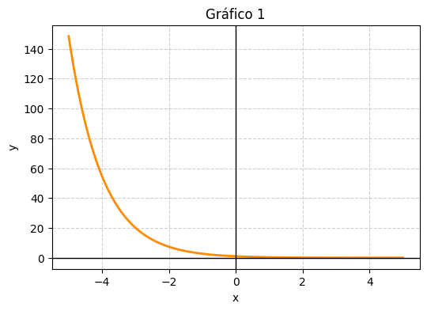 |  |
| 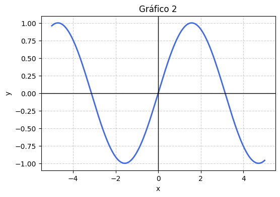 | 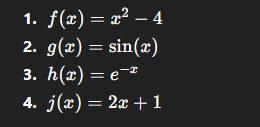 |
| 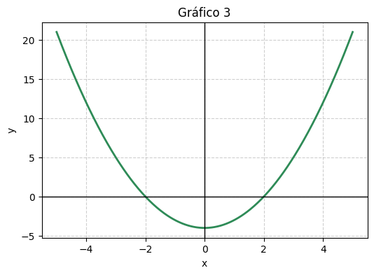 | 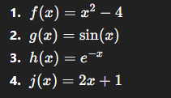 |

### Parte 2 - Distâncias e Similaridades


### **Exercício 5**. Considere os pontos na reta real:

$A(1),\quad B(4),\quad C(7)$

| 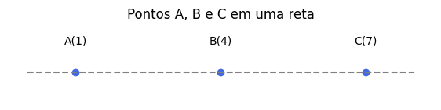 

- Calcule as distâncias euclidianas
   $d(A,B),\quad d(B,C)\quad\text{e}\quad d(A,C)$

- Verifique se essas distâncias satisfazem a desigualdade triangular:
   $d(A,C)\le d(A,B) + d(B,C)$

*(Use a fórmula da distância euclidiana em 1D: $d(X,Y)=|x_X-x_Y|$*

2. Calcule as distâncias euclidianas entre os pares de pontos.

| 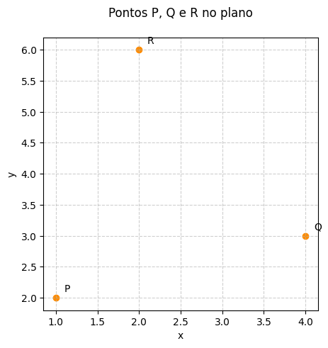 

- Qual ponto está mais distante de 𝑃?
- Considere os vetores que unem os pontos 𝑃QR. O ângulo entre os vetores  PQ e PR é pequeno ou grande?


Dadas duas palavras representadas por vetores em $R^3$: 
$𝑢=[1,2,3]$ e $𝑣=[2,0,1]$. Calcule a similaridade por cosseno entre eles. Mostre todos os passos (produto interno, normas, divisão).


### **Exercício 6** - Calcule a similaridade do cosseno entre 


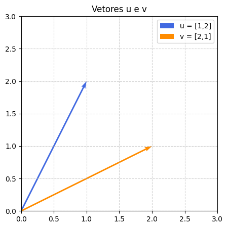 


Baseado no gráfico, o ângulo entre os vetores é pequeno ou grande?

Interprete o resultado: os vetores apontam para direções mais semelhantes ou diferentes?

# Parte 3 - Gradiente Descendente

Considere a função de erro

$$
J(w) = (w - 3)^2 + 2
$$

O objetivo é **encontrar o valor de (w)** que **minimiza (J(w))**, usando **gradiente descendente** com taxa de aprendizado (\eta = 0{,}1).
O gradiente é dado por
[
\nabla J(w) = 2(w - 3)
]

---

## Parte 1 — Observando o comportamento

A tabela abaixo mostra as 4 primeiras iterações já calculadas:

| Iteração | (w_t)  | (\nabla J(w_t)) | (J(w_t)) | Próximo ($w_{t+1}$) (já calculado) |
| -------- | ------ | --------------- | -------- | -------------------------------- |
| 0        | 0.0000 | -6.0000         | 11.000   | 0.6000                           |
| 1        | 0.6000 | -4.8000         | 7.760    | 1.0800                           |
| 2        | 1.0800 | -3.8400         | 5.686    | 1.4640                           |
| 3        | 1.4640 | -3.0720         | 4.359    | 1.7712                           |

---

## Parte 2 — Perguntas de interpretação

1. **Direção do movimento:**
   O gradiente é negativo em todas as iterações mostradas.
   **Pergunta:** o que isso nos diz sobre o comportamento da função? Estamos nos movendo para a direita ou para a esquerda no eixo (w)?
   **Explique com suas palavras.**

2. **Tamanho do passo:**
   Observe que o valor absoluto do gradiente (|-6|, |-4.8|, |-3.84|, …) está diminuindo.
   **Pergunta:** o que isso significa em termos de velocidade de aprendizado e aproximação do mínimo?

3. **Tendência:**
   Note que (w_t) está se aproximando de 3.
   **Pergunta:** se continuarmos aplicando o mesmo processo, qual seria **aproximadamente** o próximo valor (w_4)?
   (Dica: use a regra (w_{t+1} = w_t - 0{,}1 \times 2(w_t - 3)))

4. **Sentido da convergência:**
   Quando o gradiente ficar muito próximo de zero, o que isso significa?
   **Pergunta:** o que aconteceria se a taxa de aprendizado fosse **0.5** em vez de **0.1**?

---

## Parte 3 — Conclusão 

* O **sinal do gradiente** mostra **para onde andar** (positivo → esquerda, negativo → direita).
* O **módulo do gradiente** mostra **o quanto andar** (quanto mais perto do mínimo, menor o passo).
* A **taxa de aprendizado** ajusta **a sensibilidade do movimento**:
  valores altos podem causar saltos instáveis, valores baixos tornam a descida lenta.

O ponto de equilíbrio ocorre em (w = 3), onde ($\nabla J(w) = 0$).

A curva azul mostra a função de erro (J(w)), e os pontos vermelhos representam as iterações do gradiente descendente.

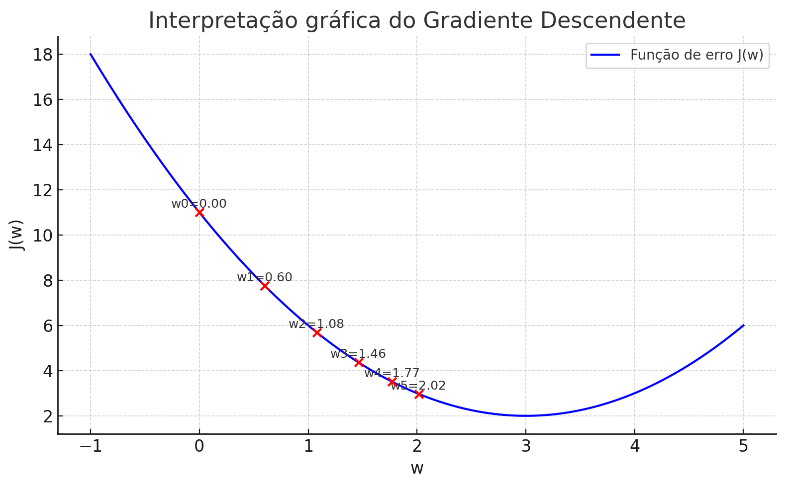

* O primeiro ponto ((w_0 = 0)) está longe do mínimo.
* A cada iteração, os pontos se aproximam de (w = 3), o fundo da parábola, onde o gradiente é zero.
* As setas (implícitas pela sequência de pontos) indicam que o algoritmo se move **da esquerda para a direita**, com **passos cada vez menores**, pois a inclinação da curva vai diminuindo — exatamente o comportamento esperado do gradiente descendente.


# Parte 4 - Simulação de Monte Carlo


**Objetivo.** Estimar, por simulação de Monte Carlo, a probabilidade de que a **soma de três dados justos**
(S = D_1 + D_2 + D_3) seja **maior ou igual a 12**.

**Definição do indicador.** Para cada rodada (i), defina
$$
I_i=\begin{cases}
1,& \text{se } S_i\ge 12\
0,& \text{caso contrário}
\end{cases}
\quad\Rightarrow\quad
\hat p_n=\dfrac{1}{n}\sum_{i=1}^{n} I_i.
$$
Ou seja, (\hat p_n) é a **estimativa corrente** de (P(S\ge 12)).

---

## Parte 1 — Rodadas já simuladas (interpretar e prever)

A tabela abaixo mostra **10 rodadas** já simuladas. O valor “Soma” é ($S_i$), “Indicador” é ($I_i$), “Acum.” é $\sum_{j=1}^{i} I_j$ e $\hat p_i$ é a estimativa até a rodada ($i$).

| Rodada (i) | (D_1,D_2,D_3) | Soma ($S_i$) | Indicador ($I_i$) | Acum. ($\sum_{j=1}^{i} I_j$) | ($\hat p_i$) |
| ---------- | ------------- | ---------- | --------------- | -------------------------- | ---------- |
| 1          | 2, 5, 3       | 10         | 0               | 0                          | 0.000      |
| 2          | 6, 4, 2       | 12         | 1               | 1                          | 0.500      |
| 3          | 1, 1, 6       | 8          | 0               | 1                          | 0.333      |
| 4          | 5, 5, 2       | 12         | 1               | 2                          | 0.500      |
| 5          | 4, 3, 4       | 11         | 0               | 2                          | 0.400      |
| 6          | 6, 6, 1       | 13         | 1               | 3                          | 0.500      |
| 7          | 3, 2, 3       | 8          | 0               | 3                          | 0.429      |
| 8          | 6, 5, 2       | 13         | 1               | 4                          | 0.500      |
| 9          | 4, 6, 1       | 11         | 0               | 4                          | 0.444      |
| 10         | 2, 2, 6       | 10         | 0               | 4                          | 0.400      |

---

## Parte 2 — Perguntas de interpretação

1. **Direção da estimativa.**
   Observando ($\hat p_i$) ao longo das rodadas, descreva com suas palavras o que acontece com a estimativa quando aparecem sucessos ($I_i=1$) ou fracassos ($I_i=0$). Ela parece “oscilar” em torno de algum valor? Por quê?

2. **Próximo passo (previsão).**
   Sem fazer uma nova simulação, **preveja** o valor de $\hat p_{11}$) **nos dois cenários**:
   a) se a próxima soma $S_{11}\ge 12$ (isto é, $I_{11}=1$);
   b) se $S_{11}<12$ (isto é, $I_{11}=0$).
   Dica: use ( $\hat p_{11} = \dfrac{\text{Acum. em } i=10 + I_{11}}{11}$ ).

3. **Sensibilidade da estimativa.**
   Explique por que a **mudança máxima** possível em $\hat p_n$ **após uma única nova rodada** diminui quando (n) aumenta. O que isso diz sobre a “estabilidade” da estimativa quando fazemos muitas simulações?

4. **Interpretação prática.**
   Imagine que essa probabilidade represente a chance de um **evento crítico** (por exemplo, ultrapassar um limite de risco). Como você explicaria, para alguém não técnico, por que **mais simulações** aumentam a **confiança** nessa estimativa?

---

## Parte 3 — Continuação (agregada) para consolidar a ideia

Após mais **50 rodadas**, obteve-se **24 sucessos** (sem detalhar cada tripla de dados). Atualize a estimativa **global**:
$$
\hat p_{60} = \frac{\underbrace{4}*{\text{sucessos até } i=10} + \underbrace{24}*{\text{sucessos novos}}}{60}.
$$
Calcule $\hat p_{60}$ e compare qualitativamente com $\hat p_{10}=0{,}4$. A estimativa ficou mais estável? Por quê?


---

# Apêndice: Como calcular o seno

Vamos resolver a equação

$$
2\sin(x) + \sqrt{3} = 0
$$


### Passo 1: Isolar o seno

$$
2\sin(x) + \sqrt{3} = 0
$$

Subtraindo ($\sqrt{3}$) dos dois lados:

$$
2\sin(x) = -\sqrt{3}
$$

Dividindo por 2:

$$
\sin(x) = -\frac{\sqrt{3}}{2}
$$

---

### Passo 2: Encontrar o ângulo de referência

Sabemos que ($\sin(60°) = \frac{\sqrt{3}}{2}$).
Portanto, o ângulo de referência é (60°).

Como o seno está negativo, o ângulo está nos quadrantes III e IV, onde o seno é menor que zero.

---

### Passo 3: Determinar as soluções principais

No quadrante III:
$$
x_1 = 180° + 60° = 240°
$$

No quadrante IV:
$$
x_2 = 360° - 60° = 300°
$$

---

### Passo 4: Escrever as soluções gerais

O seno é periódico com período de (360°).
Logo, as soluções gerais são:

$$
x = 240° + 360°k \quad \text{ou} \quad x = 300° + 360°k, \quad k \in \mathbb{Z}
$$

---

### Passo 5: Conferindo em Python

```python
import math

for angulo in [240, 300]:
    print(f"sin({angulo}°) =", round(math.sin(math.radians(angulo)), 3))
```

Saída:

```
sin(240°) = -0.866
sin(300°) = -0.866
```

Como ($\sqrt{3}/2 \approx 0.866$), o resultado confirma que

$\sin(x) = -\frac{\sqrt{3}}{2}$


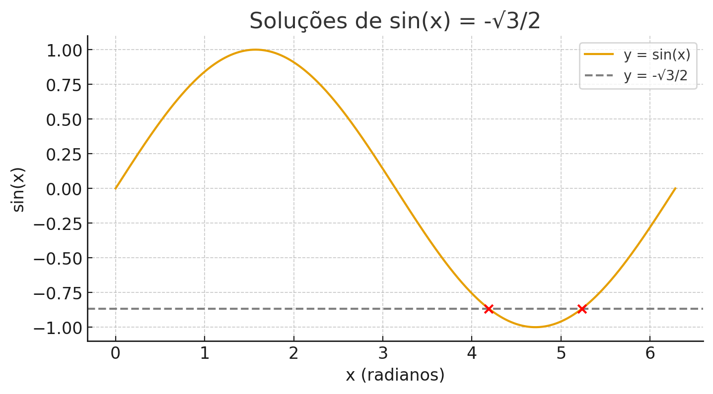
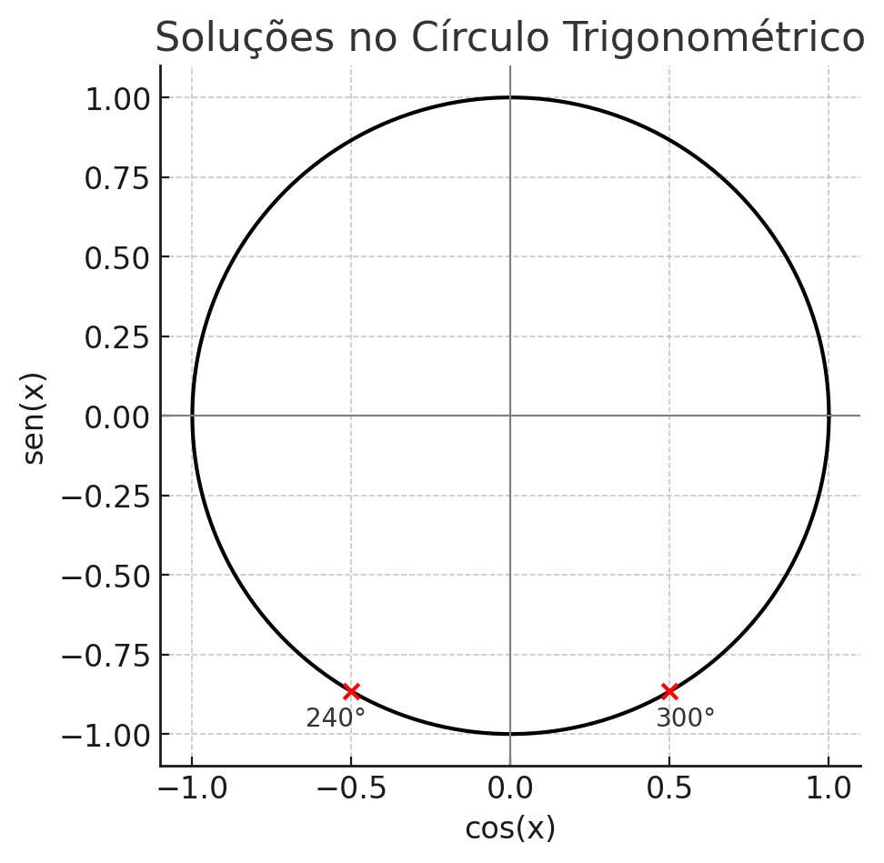


### Tabela do Seno 

| Ângulo (°) | Ângulo (rad) | sen(θ) exato / aproximado |
| ---------- | ------------ | ------------------------- |
| 0°         | 0            | 0.0000                    |
| 15°        | π/12         | 0.2588                    |
| 30°        | π/6          | 0.5000                    |
| 45°        | π/4          | 0.7071                    |
| 60°        | π/3          | 0.8660                    |
| 75°        | 5π/12        | 0.9659                    |
| 90°        | π/2          | 1.0000                    |
| 105°       | 7π/12        | 0.9659                    |
| 120°       | 2π/3         | 0.8660                    |
| 135°       | 3π/4         | 0.7071                    |
| 150°       | 5π/6         | 0.5000                    |
| 165°       | 11π/12       | 0.2588                    |
| 180°       | π            | 0.0000                    |
| 195°       | 13π/12       | -0.2588                   |
| 210°       | 7π/6         | -0.5000                   |
| 225°       | 5π/4         | -0.7071                   |
| 240°       | 4π/3         | -0.8660                   |
| 255°       | 17π/12       | -0.9659                   |
| 270°       | 3π/2         | -1.0000                   |
| 285°       | 19π/12       | -0.9659                   |
| 300°       | 5π/3         | -0.8660                   |
| 315°       | 7π/4         | -0.7071                   |
| 330°       | 11π/6        | -0.5000                   |
| 345°       | 23π/12       | -0.2588                   |
| 360°       | 2π           | 0.0000                    |


# Intuição Gradiente Descendente

Vamos aprofundar essa ideia — o **sinal do gradiente** é, de fato, o que indica **a direção da descida**. Abaixo vai uma explicação intuitiva e depois uma mais formal.

---

## 1. Intuição: “subida” e “descida” no terreno

Imagine que (J(w)) é uma **colina** e você está nela, tentando chegar ao ponto mais baixo.
O **gradiente** é uma “bússola” que aponta **para o lado da subida mais íngreme**.

* Se o **gradiente é positivo**, quer dizer que, se você andar para a direita, **a altura aumenta**.
  Logo, o caminho para **descer** é o **oposto**, ou seja, andar para a **esquerda**.
* Se o **gradiente é negativo**, isso indica que, ao andar para a direita, **a altura diminui**.
  Então, o caminho de descida é para a **direita** (seguir aumentando (w)).

Por isso a fórmula do gradiente descendente tem um **sinal de menos**:
$$
w_{t+1} = w_t - \eta \nabla J(w_t)
$$
Ela garante que você sempre anda **na direção contrária ao gradiente**, ou seja, sempre descendo a montanha.

---

## 2. Visualizando o sentido do movimento

Pense na função $J(w) = (w - 3)^2 + 2$

| Região  | Sinal do gradiente | Efeito                                                                                |
| ------- | ------------------ | ------------------------------------------------------------------------------------- |
| (w < 3) | negativo           | estamos à esquerda do mínimo → função desce se formos para a direita → aumentamos (w) |
| (w > 3) | positivo           | estamos à direita do mínimo → função desce se formos para a esquerda → diminuímos (w) |
| (w = 3) | zero               | ponto de equilíbrio → nenhum movimento                                                |

Assim, o algoritmo naturalmente “puxa” (w) em direção a 3, porque cada passo sempre aponta para o centro da parábola.

---

## 3. Relação com a fórmula

No passo:
$$
w_{t+1} = w_t - \eta , \nabla J(w_t)
$$

* Se ($\nabla J(w_t) > 0$) → o termo ($-\eta \nabla J(w_t)$) é **negativo**, logo ($w_{t+1} < w_t$): andamos **para a esquerda**.
* Se ($\nabla J(w_t) < 0$) → o termo ($-\eta \nabla J(w_t)$) é **positivo**, logo ($w_{t+1} > w_t$): andamos **para a direita**.

Ou seja:

> O **sinal do gradiente** diz se estamos à direita ou à esquerda do mínimo,
> e o **sinal de menos** na fórmula garante que o movimento sempre vá em direção ao ponto mais baixo.

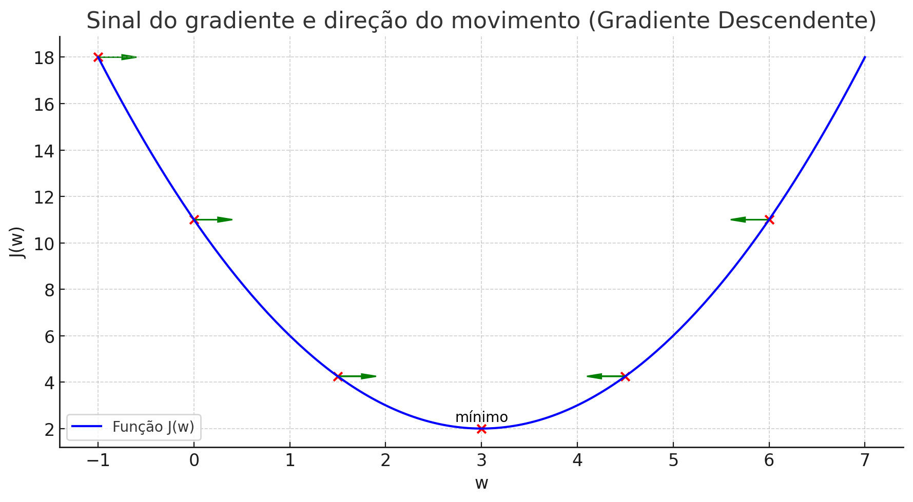
O gráfico com **setas verdes** mostrando a **direção do movimento**:

* À **esquerda de (w=3)** (onde o gradiente é negativo), as setas apontam **para a direita** — o algoritmo aumenta (w).
* À **direita de (w=3)** (onde o gradiente é positivo), as setas apontam **para a esquerda** — o algoritmo diminui (w).
* No **ponto (w=3)**, não há seta: o gradiente é zero e o algoritmo para — chegamos ao **mínimo**.

Esse é exatamente o comportamento do gradiente descendente: **seguir sempre na direção oposta à inclinação** até atingir o ponto mais baixo da curva.

Provas rápidas:

1. Caso (w<3) (ex.: (w=2{,}5))
   $\nabla J(w)=2(w-3) < 0$.
   Teste local: $J(2{,}6)=(2{,}6-3)^2+2=2{,}16 < J(2{,}5)=2{,}25$. A função **desce** quando **aumentamos** $w$ Logo, movemos para a direita.

2. Caso (w>3) (ex.: (w=3{,}5))
   $\nabla J(w)=2(w-3) > 0$
   Teste local: $J(3{,}4)=(3{,}4-3)^2+2=2{,}16 < J(3{,}5)=2{,}25$ A função **desce** quando **diminuímos** (w). Logo, movemos para a esquerda.

3. Caso (w=3)
   $\nabla J(w)=0$. Não há direção de descida: é o mínimo.

Outra forma de ver: minimizar (J(w)=(w-3)^2+2) é o mesmo que **reduzir (|w-3|)**.

* Se (w<3), aumentar (w) reduz (|w-3|).
* Se (w>3), diminuir (w) reduz (|w-3|).

E pela atualização (w_{t+1}=w_t-\eta,\nabla J(w_t)):

* Se $nabla J<0$, então $-\eta,\nabla J>0$ e (w) **aumenta**.
* Se $nabla J>0$, então $-\eta,\nabla J<0$ e (w) **diminui**.

Portanto, a leitura da sua tabela está certa:

* (w<3) → gradiente negativo → andar para a **direita** (aumentar (w));
* (w>3) → gradiente positivo → andar para a **esquerda** (diminuir (w));
* (w=3) → gradiente zero → **parar**.

